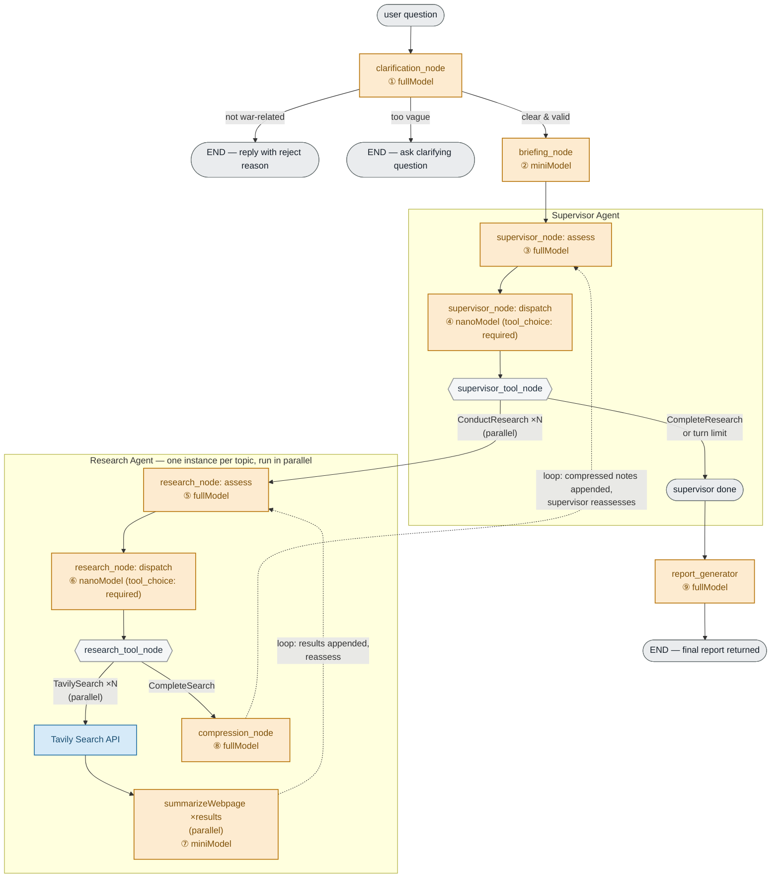

# War Research — Question Processing Flow Graph

## How a user question flows through the system

Each box is a step in the pipeline; arrows show the order actions happen in. Amber boxes are LLM calls (with their model tier), blue is the one external tool call, grey diamonds are routing/decision points with no LLM involved.

**Reading the loops:** the Supervisor Agent keeps assessing → dispatching → routing until it calls `CompleteResearch` (or hits its turn limit); each `ConductResearch` call spins up a parallel Research Agent instance, which itself loops assess → dispatch → search → summarize until it calls `CompleteSearch`, then compresses its findings and hands them back to the supervisor for the next reassessment round.
