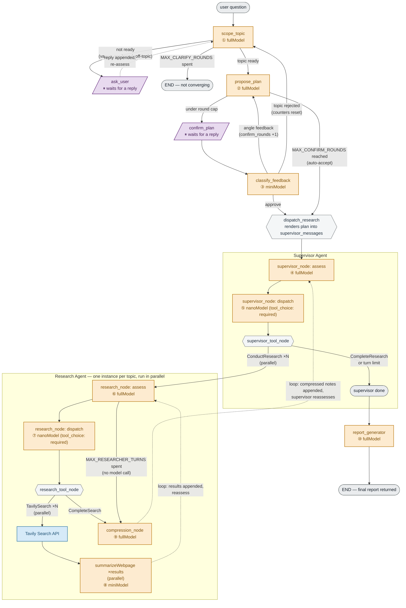

# War Research — Question Processing Flow Graph

## How a user question flows through the system

Each box is a step in the pipeline; arrows show the order actions happen in. Amber boxes are LLM calls (with their model tier), blue is the one external tool call, grey diamonds are routing/deterministic steps with no LLM involved, and purple parallelograms are `interrupt()` pauses — the graph stops there and waits for the user to resume the thread.

```mermaid
flowchart TD
    Q_START(["user question"]) --> SCOPE["scope_topic<br/>① fullModel"]

    SCOPE -- "not ready\n(vague, too broad, off-topic)" --> ASK[/"ask_user<br/>⏸ waits for a reply"/]
    ASK -. "reply appended,\nre-assess" .-> SCOPE
    SCOPE -- "MAX_CLARIFY_ROUNDS spent" --> END_GIVEUP(["END — not converging"])
    SCOPE -- "topic ready" --> PROPOSE["propose_plan<br/>② fullModel"]

    PROPOSE -- "under round cap" --> CONFIRM[/"confirm_plan<br/>⏸ waits for a reply"/]
    CONFIRM --> CLASSIFY["classify_feedback<br/>③ miniModel"]
    CLASSIFY -- "angle feedback\n(confirm_rounds +1)" --> PROPOSE
    CLASSIFY -- "topic rejected\n(counters reset)" --> SCOPE

    CLASSIFY -- "approve" --> DISPATCH{{"dispatch_research<br/>renders plan into supervisor_messages"}}
    PROPOSE -- "MAX_CONFIRM_ROUNDS reached\n(auto-accept)" --> DISPATCH

    DISPATCH --> SASSESS

    subgraph SUP[" Supervisor Agent "]
        direction TB
        SASSESS["supervisor_node: assess<br/>④ fullModel"] --> SDISPATCH["supervisor_node: dispatch<br/>⑤ nanoModel (tool_choice: required)"]
        SDISPATCH --> SROUTE{{"supervisor_tool_node"}}
        SROUTE -- "CompleteResearch\nor turn limit" --> SUP_DONE(["supervisor done"])
    end

    SROUTE -- "ConductResearch ×N\n(parallel)" --> RASSESS

    subgraph RES[" Research Agent — one instance per topic, run in parallel "]
        direction TB
        RASSESS["research_node: assess<br/>⑥ fullModel"] --> RDISPATCH["research_node: dispatch<br/>⑦ nanoModel (tool_choice: required)"]
        RDISPATCH --> RROUTE{{"research_tool_node"}}
        RROUTE -- "TavilySearch ×N\n(parallel)" --> TAVILY["Tavily Search API"]
        TAVILY --> SUMM["summarizeWebpage ×results\n(parallel)<br/>⑧ miniModel"]
        SUMM -. "loop: results appended,\nreassess" .-> RASSESS
        RROUTE -- "CompleteSearch" --> COMPRESS["compression_node<br/>⑨ fullModel"]
        RASSESS -- "MAX_RESEARCHER_TURNS spent\n(no model call)" --> COMPRESS
    end

    COMPRESS -. "loop: compressed notes appended,\nsupervisor reassesses" .-> SASSESS

    SUP_DONE --> REPORT["report_generator<br/>⑩ fullModel"]
    REPORT --> END_FINAL(["END — final report returned"])

    classDef llm fill:#FDEBD0,stroke:#B9770E,color:#7E5109,stroke-width:1.5px;
    classDef tool fill:#D6EAF8,stroke:#2874A6,color:#1B4F72,stroke-width:1.5px;
    classDef route fill:#F4F6F7,stroke:#909497,color:#212F3D,stroke-width:1.5px;
    classDef pause fill:#E8DAEF,stroke:#6C3483,color:#4A235A,stroke-width:1.5px;
    classDef term fill:#EAECEE,stroke:#616A6B,color:#17202A,stroke-width:1px;

    class SCOPE,PROPOSE,CLASSIFY,SASSESS,SDISPATCH,RASSESS,RDISPATCH,SUMM,COMPRESS,REPORT llm;
    class TAVILY tool;
    class DISPATCH,SROUTE,RROUTE route;
    class ASK,CONFIRM pause;
    class Q_START,END_GIVEUP,END_FINAL,SUP_DONE term;
```

**Reading the pre-research loops:** nothing is researched until the user agrees to a plan. `scope_topic` judges the whole conversation, not just the last turn, and keeps nudging through `ask_user` until there is a workable topic — or until `MAX_CLARIFY_ROUNDS` is spent. It does *not* ask the user to confirm that they want research: a specific in-scope topic is taken as the request, and `confirm_plan` below is the consent gate, better informed because it shows the plan first. Only an explicit hold ("don't research this yet") stops a workable topic from being planned. `propose_plan` then turns that topic into at most `MAX_ANGLES_PER_PLAN` angles — fewer when the topic does not support more — and pauses at `confirm_plan` for a free-text reply, which `classify_feedback` reads as approve / revise-the-angles / wrong-topic. Angle feedback spends a confirmation round; approving costs nothing. After `MAX_CONFIRM_ROUNDS` rejections the next plan is auto-accepted rather than asking again.

**Reading the research loops:** the Supervisor Agent keeps assessing → dispatching → routing until it calls `CompleteResearch` (or hits its turn limit); each `ConductResearch` call spins up a parallel Research Agent instance, which itself loops assess → dispatch → search → summarize until it calls `CompleteSearch` (or, like the supervisor, hits its turn limit — checked at the top of `research_node`, before either model is called), then compresses its findings and hands them back to the supervisor for the next reassessment round.

**Where the plan ends up:** `dispatch_research` is the only seam between the two halves. It renders the confirmed `plan` into the single `HumanMessage` that seeds `supervisor_messages`, and `report_generator` renders the same plan into its prompt. There is no separate `research_brief` — the plan *is* the brief.
